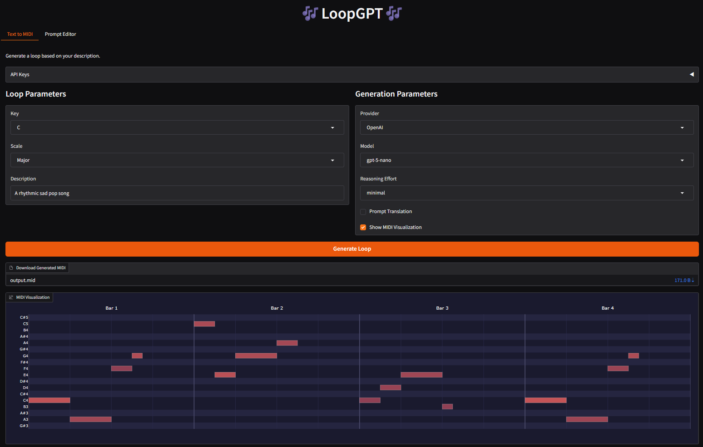

# 🎵 LoopGPT: AI-Powered Music Generation 🎵



This project is a music generation tool that enables users to create 4 bar loops using an intuitive Gradio web interface. By leveraging AI model APIs from multiple providers, the application generates MIDI compositions based on user-defined parameters, making it a great resource for musicians, producers, and AI music enthusiasts.

## ✨ Features

- Interact with a sleek Gradio interface for an inviting user experience
- Visualize MIDI output using piano roll display
- View/Edit the system prompts that instruct the model through the generation process
- Generate 4-bar loops with customizable parameters
- Optional prompt translation for guided reasoning when using language models
- Support for sixteenth note resolution
- Save full API message history to JSON files for training examples

## 🚀 Quick Start
### Installation
Clone this repository:
```sh
git clone https://github.com/laceyp99/LoopGPT.git
cd LoopGPT
```
Install required dependencies:
```sh
pip install -r requirements.txt
```
Set up your API keys in `src/.env` or via the Gradio “API Keys” panel:
```ini
OPENAI_API_KEY="your-openai-api-key-here"
GEMINI_API_KEY="your-gemini-api-key-here"
ANTHROPIC_API_KEY="your-anthropic-api-key-here"
```
### Run the Gradio UI
To start the web interface locally, run:
```sh
python app.py
```
Then visit [localhost](http://127.0.0.1:7860/) to access the UI.

## 🎼 Usage

1. **Select your parameters**  
   - Key & scale (Major/minor)  
   - Text description (e.g. “Daniel Caesar R&B soul piano loop”)  
   - Model & temperature  
   - Optional: Prompt Translation (recommended for smaller/less intelligent LLMs)  
   - Optional: Show MIDI visualization  
   - Optional: Edit the System Prompts in the Prompt Editor tab

2. **Generate & Download**  
   - Click **Generate Loop**  
   - Download the MIDI file via the “Download Generated MIDI” widget  
   - View the piano-roll image (if enabled)

3. **Inspect JSON logs**  
   - `prompt_translation.json` and `loop.json` record the full message exchange and structured loop data  

## Evaluation
The evaluation suite gives a quick sanity check that each model can follow core structural instructions for a 4‑bar loop.

What we currently test:
- `Bar length`: Exactly 4 bars based on the expected ticks
- `Scale compliance`: All note_on events fit the requested key/scale
   - C, A, and G (Major and minor)
- `Uniform note length`: All notes the specific length when requested
   - quarter and eighth notes

How it works:
- A small grid of prompts (root × scale × note duration) is generated.
- Each model (and optional “thinking” variant) is asynchronously invoked.
- Results stream into a live Rich table (counts, pass %, avg latency, avg cost).
- Artifacts saved for later musical / qualitative review.

### Quick start
To start the evaluation process locally, run:
```sh
python evaluation/evaluator.py
```
**Warning:** This will need to run for at least 15 minutes and will cost around $20 in API calls.

### Results


## 📂 Project Structure

- `app.py`: The Gradio UI layout facilitating the generation process.
- `model_list.json`: The main JSON database for model pricing and other characteristics
- `src/`
  - `.env`: Configuration file
  - `gpt_api.py`: OpenAI GPT endpoints (prompt translation & structured loop generation)
  - `o_api.py`: OpenAI reasoning (o series) endpoints
  - `gemini_api.py`: Google Gemini endpoints 
  - `claude_api.py`: Anthropic Claude endpoints
  - `ollama_api.py`: Ollama API endpoints
  - `midi_processing.py`: Conversion between `Loop` objects and `mido.MidiFile`
  - `objects.py`: Pydantic models for notes, bars, loops (with `_G` variants for Gemini)
  - `utils.py`: MIDI ↔ JSON helpers, visualization, message-logging
  - `runs.py`: Routes the generation (with prompt translation if directed) to the right API
- `Prompts/`
  - `loop gen.txt`: System prompt for generating the 4-bar loop
  - `prompt translation.txt`: System prompt for enriching user descriptions
- `evaluation/`
  - `Results/`: Images showing evaluation analysis for the README
  - `tests.py`: The midi validation tests for the evaluation
  - `evaluator.py`: The async evaluation script with live CLI table logging
  - `ollama_eval.py`: The serial evaluation for local model testing
- `requirements.txt`: List of Python dependencies
- `loop.json`: JSON log of the MIDI-generation conversation
- `prompt_translation.json`: JSON log of the prompt-translation conversation
- `output.mid`: The most recent generated MIDI file

## ⚠️ Limitations

- The application generates MIDI files at a fixed tempo of ***120 BPM***, but can easily be changed in any DAW.
- The application currently supports only ***4-bar*** segments in ***4/4*** time signature.
- Generated music may require post-processing for professional use.
- The quality of generated music depends on the prompt and model parameters.
- Requires an active internet connection for API calls to model providers.
- High API usage may incur significant costs.