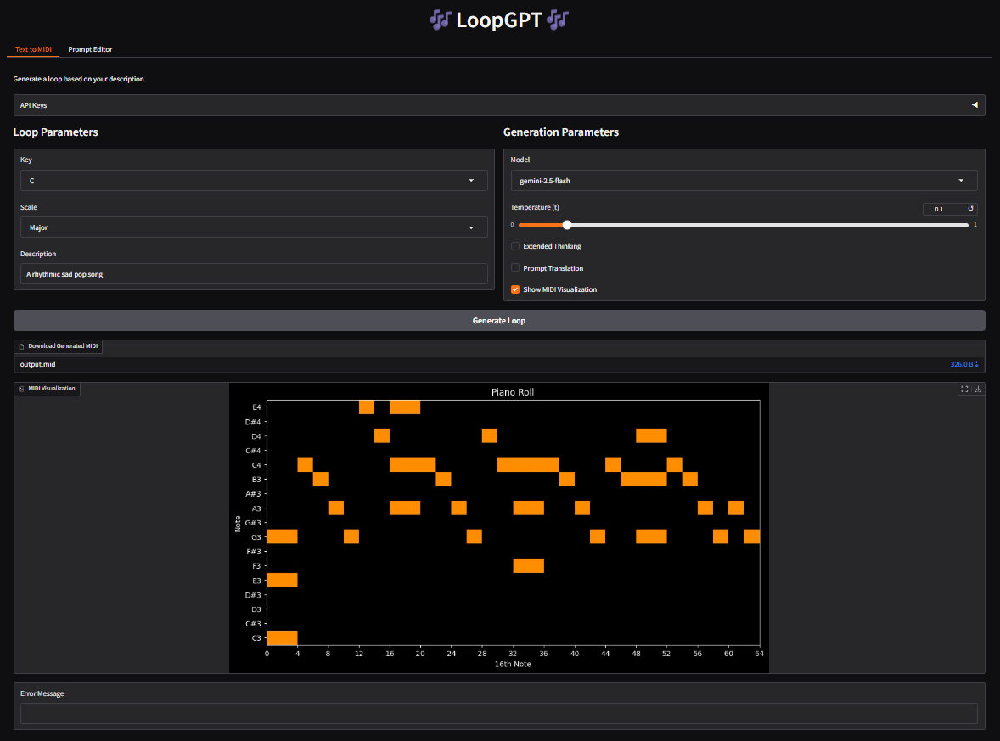

# LoopGPT: AI-Powered Music Generation



This project is a music generation tool that enables users to create 4 bar loops using an intuitive Gradio web interface. By leveraging AI model APIs from multiple providers, the application generates MIDI compositions based on user-defined parameters, making it a great resource for musicians, producers, and AI music enthusiasts.

## Features

- Interact with a sleek Gradio interface for an inviting user experience
- Visualize MIDI output using piano roll display
- Audio playback to listen to generated MIDI inside the browser
- Manage your last 20 generations from the history sidebar
- View/Edit the system prompts that instruct the model through the generation process
- Generate 4-bar loops with customizable parameters
- Optional prompt translation for guided reasoning when using language models
- Support for sixteenth note resolution
- Save full API message history to JSON files for training examples

## Quick Start
### Installation
Clone this repository:
```sh
git clone https://github.com/laceyp99/LoopGPT.git
cd LoopGPT
```
Install required dependencies:
```sh
pip install -r requirements.txt
```

### Audio Playback Setup (Optional)
To enable audio playback of generated MIDI loops, you'll need:

1. **FluidSynth** - MIDI synthesizer
   - Windows: Download from [FluidSynth releases](https://github.com/FluidSynth/fluidsynth/releases) and add to PATH
   - macOS: `brew install fluidsynth`
   - Linux: `apt install fluidsynth`

2. **FFmpeg** - Audio encoding
   - Windows: Download from [ffmpeg.org](https://ffmpeg.org/download.html) and add to PATH
   - macOS: `brew install ffmpeg`
   - Linux: `apt install ffmpeg`

3. **SoundFont file** - Piano samples
   - Download [Salamander Grand Piano](https://freepats.zenvoid.org/Piano/acoustic-grand-piano.html) (~400MB)
   - Extract and place `SalamanderGrandPiano.sf2` in the `soundfonts/` directory

*Note: Audio playback is optional. The app will still generate and download MIDI files without these dependencies.*

Set up your API keys in `src/.env` or via the Gradio "API Keys" panel:
```ini
OPENAI_API_KEY="your-openai-api-key-here"
GEMINI_API_KEY="your-gemini-api-key-here"
ANTHROPIC_API_KEY="your-anthropic-api-key-here"
OLLAMA_API_HOST_ADDRESS="your-ollama-base-url-here"
```
### Run the Gradio UI
To start the web interface locally, run:
```sh
python app.py
```
Then visit [localhost](http://127.0.0.1:7860/) to access the UI.

## Usage

1. **Select your parameters**  
   - Key & scale (Major/minor)  
   - Text description (e.g. "Daniel Caesar R&B soul piano loop")  
   - Model & temperature  
   - Optional: Prompt Translation (recommended for smaller/less intelligent LLMs)  
   - Optional: Show MIDI visualization  
   - Optional: Edit the System Prompts in the Prompt Editor tab

2. **Generate & Download**  
   - Click **Generate Loop**  
   - Download the MIDI file via the "Download Generated MIDI" widget  
   - Listen to the audio preview (if playback is configured)
   - View the piano-roll image (if enabled)

3. **Browse History**
   - Click **History** to open the sidebar
   - Select a previous generation from the dropdown
   - Click **Load** to view/play it, or **Delete** to remove it

4. **Inspect JSON logs**  
   - `prompt_translation.json` and `loop.json` record the full message exchange and reasoning  

## Project Structure

- `app.py`: The Gradio UI layout facilitating the generation process.
- `model_list.json`: The main JSON database for model pricing and other characteristics
- `Prompts/`
  - `loop gen.txt`: System prompt for generating the 4-bar loop
  - `prompt translation.txt`: System prompt for enriching user descriptions
- `src/`
  - `.env`: Configuration file
  - `openai_api.py`: OpenAI Responses endpoints
  - `gemini_api.py`: Google Gemini endpoints 
  - `claude_api.py`: Anthropic Claude endpoints
  - `ollama_api.py`: Ollama API endpoints
  - `midi_processing.py`: Conversion between `Loop` objects and `mido.MidiFile`
  - `objects.py`: Pydantic models for notes, bars, loops (with `_G` variants for Gemini)
  - `utils.py`: MIDI to JSON helpers, visualization, message-logging
  - `runs.py`: Routes the generation (with prompt translation if directed) to the right API
  - `audio.py`: MIDI to audio conversion using FluidSynth
  - `history.py`: Session history management (save/load/delete generations)
- `evaluation/`
  - `tests.py`: The midi validation tests for the evaluation
  - `evaluator.py`: The evaluator class with the ability for modular testing
  - `analysis.py`: The data analysis visualization of the evaluation data
  - `README.md`: Further documentation on the evaluation subdirectory
- `soundfonts/`: Place SoundFont (.sf2) files here for audio playback
- `requirements.txt`: List of Python dependencies
- `loop.json`: JSON log of the MIDI-generation conversation
- `prompt_translation.json`: JSON log of the prompt-translation conversation
- `output.mid`: The most recent generated MIDI file
- `output.mp3`: The most recent converted audio file

## Limitations

- The application generates MIDI files at a fixed tempo of ***120 BPM***, but can easily be changed in any DAW.
- The application currently supports only ***4-bar*** segments in ***4/4*** time signature.
- Generated music may require post-processing for professional use.
- The quality of generated music depends on the prompt and model parameters.
- Requires an active internet connection for API calls to model providers.
- High API usage may incur significant costs.